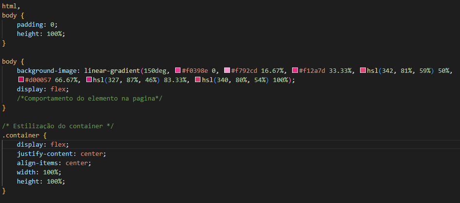
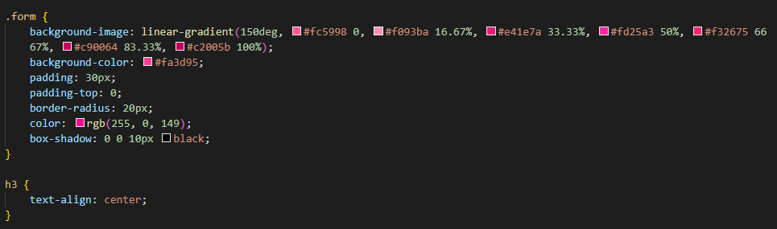
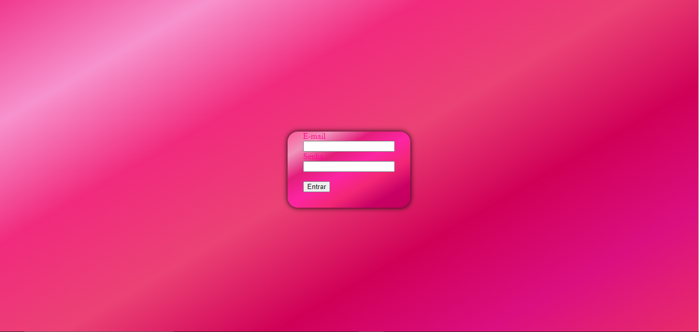

# Projeto-login

## Índice
* [Descrição](#descrição)
* [Tecnologias](#tecnologias)
* [Referências](#referências)
* [Autor(a)](#autora)
 
### Descrição
Este projeto é uma página de login simples, estilizada com CSS, projetada para ser usada como uma forma de autenticação básica.
 
#### Tabela

* `padding`-define uma a distância entre o conteúdo de um elemento e suas bordas, ele esta sendo usado no elemento body e na class form. 

* `background`-image- faz parte do conjunto de propriedades utilizadas na linguagem de estilo para definir o background, ou seja, a parte do fundo de um elemento que, nesse caso, corresponde a aplicação de uma ou mais imagens para modificar a sua aparência,ele esta sendo usado no elemento body e na class form. 

* `display`- define o comportamento do elemento em relação aos demais elementos do documento, ele esta sendo usado no elemento body e na class container.

* `justify-content`- é usada para alinhar os elementos ao longo do eixo principal (main-axis), cuja direção (row ou column) é definida a partir da propriedade flex-direction, esta sendo utilizado na class container.

* `align-items`- estabelece o alinhamento de um certo item dentro do bloco que o contém.

* `width`-determina a largura da área de conteúdo de um elemento, esta sendo utilizado na class container.

* `height`- determina a altura da área do conteúdo de um elemento, esta sendo utilizado na class container.

Veja uma imagem de parte do codigo, onde é possivel indentificar o uso dos elementos mencionados a cima:

 
 
* `padding-top` - define as dimensões do espaçamento interno superior (distância do elemento para sua própria borda), esta sendo utilizado na class form.

* `border-radius`- destina-se a definir bordas arredondadas, esta sendo utilizado na class form.

* `color`- indica uma cor no espaço, esta sendo utilizado na class form.

* `box-shadow`-é utilizado para adicionar efeitos de sombra em volta de um elemento, esta sendo utilizado na class form.

* `text-align`- descreve como conteúdo inline, como texto, é alinhado no elemento pai em bloco. esta sendo utilizado no elemento h3

Veja uma imagem de parte do codigo, onde é possivel indentificar o uso dos elementos mencionado a cima:

### Resultado do projeto

 
## Tecnologias
* HTML5
* CSS3
* Git
* Github
 
## Referências
 
[Alura](https://www.alura.com.br/artigos/escrever-bom-readme) - Como escrever um README incrivel no seu gitHub
 
## Autor(a)
* Yasmim Faria
